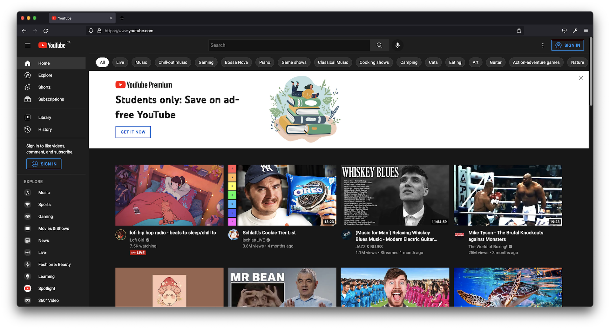

# YouTube Minimum
YouTube Minimum is a  lightweight browser extension that removes recommendations on YouTube to avoid distractions.
User can focus on what they currently watch and avoid the temptation to watch another video from the recommendation list.

I built this extension because I notice I spent too much time on YouTube by watching more and more videos on the recommendation list. The extension blocks all other videos other than the one I searched for. 

## Sceenshots
### Before installation:

### After installation:

## Installation
Since the extension hasn’t published on Chrome Web store nor Firefox Add-ons, it needs to install using developer mode as of now =[ (Will work on it in the future).

**For Chrome:**

On the browser type `chrome://extensions/` > Toggle `Developer mode` (on the right corner) > `Load unpacked` (on the left corner) > Download this repo and select the Chrome folder

**For Firefox:**

Note: Since it is not published on Firefox Add-ons, due to security reasons, Firefox only allow user to install on Firefox Developer Edition or FireFox Nightly.

1. Allow unsigned extension
   
   On browser type `about:config` > Click "Accept the Risk and Continue" > Change `xpinstall.signatures.required` to `false`

2. Create the build
   
   Download this repo, go to Firefox folder, then compress all files inside that folder, you will receive a zip file. 
   
   (Or you can use `web-ext build --verbose` in termainl, you need to install web-ext CLI)

3. Install
   
   On the browser type `about:addons` > Select the `Settings icon` > Click on `Install Add-on From File...` > Select the zip file that you created > A popup will appear saying the the extension is unverified, click Add

**TODO:**
- design popup
- add logo
